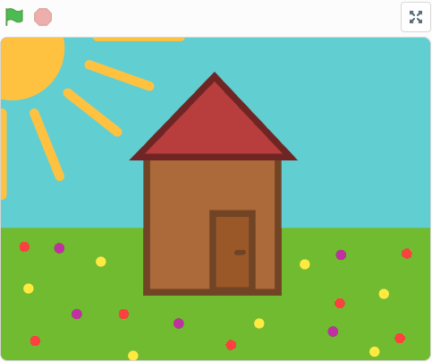
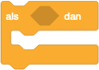
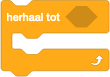
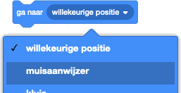
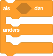
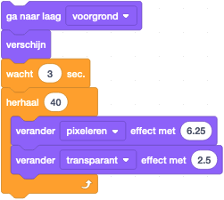

# Escaperoom
*Bouw een escaperoom in Scratch*

In deze opdracht gaan we zelf een escaperoom bouwen. We beginnen in een kamer met wat spullen (zoals een tapijt, een schilderij, en een kluis). De deur in die kamer is 'op slot'. Het doel van het spel is om de deur open te maken door erop te klikken, zodat je naar buiten kunt.

Zo ziet het er uit als je de opdracht klaar hebt:

We beginnen met een leeg project waar alle benodigde sprites al in zitten. Op deze manier hoef je je alleen maar druk te maken om de code-blokken! Dit lege project kun je in de Scratch editor openen via ons [escaperoom startproject](https://scratch.mit.edu/projects/756757402/editor). Gebruik je de Sratch offline editor (die je [hier](https://scratch.mit.edu/download) kunt downloaden), dan kun je het startproject ook [hier](resources/escaperoom_nl.sb3) downloaden en daarna in de offline editor laden.

## Startsituatie

We beginnen om alle sprites een goede startpositie te geven als we ons spel starten. Mocht er tijdens het spel per ongeluk iets verschuiven, dan weten we dat de volgende keer alles weer goed staat zoals we hebben bedoeld.

### Verberg Huis en 'ontsnapt'-tekst

Het huisje moet pas getoond worden als de deur open is. Dus die moet verborgen worden als op de groene vlag wordt gedrukt. Hiervoor bestaat de gebeurtenis "wanneer op  wordt geklikt".

1. Selecteer de **ontsnapt!**-sprite
2. Zoek bij *Gebeurtenissen* het volgende blokje:  
   
3. Sleep deze naar het grote witte vlak in het midden
4. Zoek bij *Uiterlijken* het volgende blokje:  
   
5. Zet deze vast aan het blokje erboven

Je kunt op twee manieren controleren of je code werkt:

* door éénmaal met je muis op jouw code-blok te klikken
* door rechtsboven op de groene vlag te klikken

Als het goed is, verdwijnt het huisje nu.

> Kun jij dit nu ook doen voor de **ontsnapt!2**-sprite?

### Toon de andere objecten, met het goede uiterlijk

We gaan nu zorgen dat alle andere objecten op de juiste plek, en met het juiste uiterlijk worden getoond, als het spel wordt gestart.

Sommige sprites hebben méér dan 1 uiterlijk, dit kun je zien door bovenaan op de tab 'Uiterlijken' te klikken:  

1. Selecteer de **tapijt**-sprite
2. Net als hierboven, sleep de gebeurtenis "wanneer op de groene vlag wordt geklikt" naar het midden
3. Zoek nu bij *Uiterlijken* het volgende blokje, en sleep deze naar je code-veld:  
   
4. Kies nu het juiste uiterlijk-nummer (is dit `1` of `2`? Kijk even welke uiterlijken er beschikbaar zijn!)
5. Zoek bij *Uiterlijken* het volgende blokje, en sleep deze naar je code-veld:  
   

Werkt je code? Testen!

> Kun jij dit nu ook doen voor de **schilderij**-sprite, de **kluis**-sprite, en de **deur**-sprite?

### Startpositie

Ook willen we graag dat iedere sprite op de juiste plaats op het scherm wordt getoond, zodat het er iedere keer hetzelfde uitziet. Hiervoor laten we aan Scratch weten waar het plaatje moet staan ten opzicht van het midden van het scherm. Van links naar rechts wordt aangegeven met een `x`, en van beneden naar boven met een `y`. Laten we hiervoor beginnen met het tapijt.

1. Selecteer de **tapijt**-sprite
2. Zoek nu bij *Beweging* het volgende blokje, en sleep deze naar je code-veld vlak **boven** het "verschijn"-blokje:  
     
   Op deze manier zetten we de plaats goed voordat deze wordt getoond.
3. Zorg dat het getal achter de `x` en de `y` allebei een `0` is

> Kun jij dit nu ook doen voor de **schilderij**-sprite, de **kluis**-sprite, de **deur**-sprite, en het huisje (dus de **ontsnapt!**-sprite - bij deze vlak **boven** het "verdwijn"-blokje)?

## Rondkijken en zoeken in de kamer

Bij een escaperoom moet je op zoek gaan naar aanwijzingen om te ontsnappen. In ons kleine kamertje willen we de volgende dingen inbouwen:

* Als je onder het tapijt kijkt, vind je geen aanwijzing
* Als je achter het schilderij kijkt, zie je dat er een code op de muur staat geschreven
* Als je de kluis wilt openen, wordt er om een code gevraagd. Bij het invullen van de goede code gaat de kluis open
* In de kluis ligt een sleutel, en die sleutel moet je gebruiken om de deur van het slot te halen
* Als de deur van het slot is, kun je hem open maken en naar buiten ontsnappen

Al deze eigenschappen gaan we nu maken!

### Aanwijzingen zoeken: wisselen van uiterlijk

Als eerste willen we zorgen dat je het tapijt op kan tillen, en het schilderij opzij kan schuiven, als je er op klikt. Nog een keer klikken moet alles weer terugzetten. Dit doen we door gebruik te maken van de verschillende uiterlijken bij iedere sprite.

1. Selecteer de **tapijt**-sprite
2. Zoek nu bij *Gebeurtenissen* het volgende blokje, en sleep deze naar een leeg plekje in je code-veld:  
   
3. Zoek nu bij *Uiterlijken* het volgende blokje, en sleep deze naar je code-veld, en zet hem vast aan de goede gebeurtenis:  
   

> Kun jij dit nu ook doen voor de **schilderij**-sprite?

### De kluiscode weergeven: een uiterlijk bewerken

Toen je op het schilderij klikte, was het je misschien opgevallen dat er nog geen code op de muur geschreven stond. We gaan nu een **zelf bedachte code** op de muur achter het schilderij zetten, door het uiterlijk van het opzij geschoven schilderij te bewerken.

1. Selecteer de **schilderij**-sprite
2. Klik bovenaan op de tab 'Uiterlijken'
3. Selecteer nu het tweede uiterlijk door er op te klikken.  
   Als het goed is zie je nu het opzij geschoven schilderij in het midden van het scherm
4. Je kunt het plaatje iets groter of kleiner op je scherm krijgen door de `+` en `-` knopjes te gebruiken onderaan het scherm:  
   
5. Klik nu op het Tekst-tool: 
6. Kies zelf een passende kleur, en een leuk lettertype.
   Dit vind je bovenaan het bewerk-paneel:  
   
7. Klik nu ergens naast het schilderij op een lege plek, en typ het eerste getal van je eigen verzonnen code. Je ziet deze meteen verschijnen. Misschien moet je de plaats en de grootte nog even aanpassen, zodat het helemaal naar je zin is.
8. Doe dit ook voor de andere getallen uit je code, en zet ze op een iets andere plek.
9. Als je klaar bent, klik dan eens afwisselend op uiterlijk 1 en uiterlijk 2. Ben je tevreden met het resultaat? Anders kun je misschien nog wat bewerken tot je tevreden bent

## De kluis openen

Als je de kluis wilt openen, moeten we om een code vragen. En als die code goed is ingevuld, gaat de kluis open. Wat moeten we daarvoor doen?

#### De kluiscode vragen: waarnemen

Als je in Scratch iets wilt vragen aan de gebruiker, of kijken of er misschien een toets is ingedrukt, of dat de muis misschien beweegt, heet dat "Waarnemen". Dit gaan we hier gebruiken.

1. Selecteer de **kluis**-sprite
2. Start een nieuw stukje code, en begin weer met een gebeurtenis wanneer op de sprite wordt geklikt
3. Zoek nu bij *Waarnemen* het volgende blokje, sleep deze naar je code-veld, en zet hem vast aan de goede gebeurtenis:  
   
4. Pas de vraag aan naar `Wat is de code?`

#### De kluiscode controleren en de deur openen: besturen

Nu moeten we alleen de kluis openen als de juiste code wordt ingevoerd. Of, anders gezegd:

    ALS het antwoord hetzelfde is als de code op de muur
    DAN doe ik de kluis open
    
Om dit te kunnen doen, maken we in Scratch gebruik van de blokjes onder "Besturen". Dit kan zijn dat we ergens op willen wachten, of een als-dan vraag willen gebruiken, of zelf iets meerdere keren (of voor altijd) herhalen.

1. Zoek nu bij *Besturen* het volgende blokje, sleep deze naar je code-veld, en zet hem vast onder de vraag `Wat is de code?`:  
   
2. De `ALS` en `DAN` hebben we. Nu nog controleren of het antwoord hetzelfde is als onze code op de muur.  
   Zoek hiervoor bij *Functies* naar het volgende blokje, en sleep deze precies op de goede plek op het als-dan blokje:  
   
3. In dit groene blokje komt aan de linkerkant het antwoord op de vraag te staan. Zoek dit op bij *Waarnemen* en sleep deze naar het **linker** vakje van het groene blokje:  
   
4. Het **rechter** vakje moet nu hetzelfde zijn als jouw eigen code op de muur! Pas dus het getal `50` aan naar jouw eigen code
5. Een open kluis is bij de sprite opgeslagen als het tweede uiterlijk. Kun jij nu binnen het als-dan blokje het uiterlijk veranderen als de code goed is? Wat heb je hiervoor nodig?

De code die je hebt ingevuld achter de als-vraag heet een **conditie**. Iets wat waar of niet waar is. Of waar je met Ja of Nee op kunt antwoorden. In Scratch herken je deze aan de hoekige zijkantjes op een blok:  

> Kun je er een paar vinden bij *Waarnemen* en *Functies*?

Er is nog één dingetje wat we vergeten zijn: we moeten alléén de code vragen als de kluisdeur dicht is. Anders gezegd:

    ALS het uiterlijk-nummer hetzelfde is als 1
    DAN moet ik de code vragen en controleren

> Kun jij nu met een als-dan blokje (*Functies*) en een uiterlijk-nummer (*Uiterlijken*) zorgen dat alleen de code wordt gevraagd als de kluis nog dicht is?

##### EXTRA

Als je de uiterlijk-nummers lastig vindt (wat is nou ook alweer 1 en 2?), kun je elk uiterlijk ook een *naam* geven. Daarmee kun je je code beter leesbaar maken:

    ALS het uiterlijk een dichte kluis is
    DAN moet ik de code vragen en controleren

> Kun je eens kijken of je de naam bij de uiterlijken kunt veranderen naar bijvoorbeeld `dichte kluis` en `open kluis`?  
> 
> Wat zie je veranderen in het code-blok wanneer op de groene vlag is geklikt?  
> 
> Wat zou je aan kunnen passen in je code-blok wanneer op de sprite wordt geklikt, om van deze naam gebruik te maken?  
> Wat vind je zelf makkelijker?

## De sleutel gebruiken

De kluis is inmiddels open. Nu willen we dus de sleutel laten zien, en de sleutel moet ook gebruikt worden om de deur van het slot te halen.

### De sleutel tonen: signalen

De sleutel en de kluis zijn twee verschillende sprites. Omdat je alleen Scratch-blokken voor één sprite kunt maken, hebben we een manier nodig waarmee de ene sprite met de andere sprite kan 'praten'. Dit doen we met signalen: De kluis stuurt een bericht dat hij open is, en vervolgens kan iedere andere sprite naar dit bericht luisteren.

1. Selecteer de **kluis**-sprite
2. Zoek nu bij *Gebeurtenissen* het volgende blokje, sleep deze naar je code-veld, en zet hem vast onderaan binnen het als-dan blokje waar je in de vorige opdracht het uiterlijk hebt gewisseld:  
   
3. Klik nu op `bericht1` en kies hier "Nieuw bericht"
4. Gebruik als naam bijvoorbeeld `Kluis is open`

Er is nu een signaal ingesteld zodra er een goede code is ingevuld. Nu moeten we de sleutel laten reageren op dat berichtje, en laten verschijnen.

1. Selecteer de **sleutel**-sprite
2. Zoek nu bij *Gebeurtenissen* het volgende blokje, en sleep deze naar een leeg plekje in je code-veld:  
   
3. Klik nu op `bericht1` en kies hier het bericht wat je hierboven hebt ingevuld (bijvoorbeeld `Kluis is open`)
4. Zoek bij *Uiterlijken* het volgende blokje, en sleep deze naar je code-veld en maak hem vast aan het gele gebeurtenis blokje:  
   

Test je code door op het net gemaakte blokje te dubbelklikken. Verschijnt de sleutel nu?

Het kan zijn dat de sleutel niet verschijnt of misschien zelfs op de verkeerde plek. We willen dat de sleutel "in" de kluis ligt: de sprite moet dus op de voorgrond getoond worden, en de positie moet ook goed zijn. Dit heb je al eerder gedaan:

1. Sleep eerst het sleuteltje naar de goede plek (dus in de kluis) in het voorbeeldscherm rechtsboven
2. Als dit goed staat, zoek dan bij *Beweging* het volgende blokje, en sleep deze naar je code-veld vlak **boven** het "verdwijn"-blokje bij de groene vlag gebeurtenis:  
     
   Het getal achter de `x` en de `y` zijn nu niet nul, maar een ander getal (bijvoorbeeld `-89` en `28`)
3. Zoek bij *Uiterlijken* het volgende blokje, sleep deze naar je code-veld, en zet hem vast onder het "verschijn"-blokje:  
   

Als het goed is kun je beide blokjes testen door erop te dubbelklikken: Bij de ene verdwijnt het, en bij de andere verschijnt het voor de kluis.

### De sleutel naar de deur slepen: herhalen

De bedoeling is nu dat de sleutel naar de deur wordt gesleept om zo de deur to openen.

Om tijdens het spel een sprite te kunnen slepen, moeten we iets maken waarmee we de sprite de muisaanwijzer laten volgen **zolang** we de muisknop ingedrukt houden. Anders gezegd: de sleutel moet de muisaanwijzer blijven volgen **totdat** we de muisknop weer loslaten.

In Scratch kunnen we gebruik maken van een herhaling. In zo'n blokje vertel je *wat* er de hele tijd herhaald moet worden, en *wanneer* dat dan weer moet stoppen. Net als bij het als-dan blokje, hebben we een **conditie** nodig om te vertellen, wat met de hoekige blokjes gebeurt:  

1. Selecteer de **sleutel**-sprite
2. Zoek nu bij *Gebeurtenissen* het volgende blokje, en sleep deze naar een leeg plekje in je code-veld:  
   
3. Zoek nu bij *Besturen* het volgende blokje, sleep deze naar je code-veld, en zet hem vast aan de goede gebeurtenis:  
   

De sleutel moet dus de muisaanwijzer blijven volgen **totdat** we de muisknop weer loslaten. Er is alleen geen blokje wat controleert of de muisknop is losgelaten. Maar we kunnen wel controleren of de muisknop is ingedrukt. Daarom gaan we het volgende in een Scratch blokje maken: 

    HERHAAL TOT de muis niet meer is ingedrukt
        ga naar de muisaanwijzer

Hiervoor bestaan de volgende conditie-blokjes:

* 
* 
* 

> Kun jij het herhaal blokje nu afmaken door de blokjes hierboven op de goede manier te gebruiken?

Je kunt het nu testen door op de groene vlag te klikken en de kluis te openen. Kun je de sleutel nu verplaatsen tijdens het spel?

### De deur van het slot halen: als-dan-anders

De volgende stap is de deur te openen als de sleutel voor de deur wordt gebruikt. Dan laten we de sleutel verdwijnen (je hebt hem nu toch niet meer nodig). Maar als de sleutel ergens anders wordt losgelaten (bijvoorbeeld op het tapijt), willen we hem weer terug leggen in de kluis. Zo weet de speler dat er iets anders moet worden gedaan met de sleutel.

Dit kunnen we ook op een andere 'code'-manier zeggen:

    ALS ik de deur raak
    DAN doe de deur open
        en laat de sleutel verdwijnen
    ANDERS
        ga terug naar de kluis

1. Zoek nu bij *Besturen* het als-dan-anders blokje, sleep deze naar het code-veld, en zet deze vast onder het herhaal-blokje:  
   
2. Zoek bij *Waarnemen* de conditie of je iets raakt, en zet deze op de goede plek in het code-blok  

> Om de deur open te maken, moeten we weer gebruik maken van een signaal, bijvoorbeeld een berichtje `Deur open`. Kun jij dit signaal nu zelf instellen bij de sleutel?  

> Kun jij ook de deur openen, zodra dit signaal wordt ontvangen?  
> Hint: deze code moet je aan de **deur**-sprite toevoegen!  

> Kun je ook de sleutel laten verdwijnen nadat de deur open is gemaakt?  

> Kun je de sleutel weer terug laten gaan naar de kluis, als hij *niet* de deur heeft geraakt?

## Ontsnappen

Het laatste wat we moeten doen is door de deur naar buiten gaan, en vertellen dat je bent ontsnapt!

### Naar buiten gaan

> Kun jij aan de **deur**-sprite de gebeurtenis toevoegen wanneer op de sprite wordt geklikt, we dan de **ontsnapt!**-sprite (het huisje) laten zien?  
> Hint 1: je mag alleen de ontsnapt-sprite laten zien als de deur open is! Gebruik een als-dan blokje om te controleren of de deur echt open is (welk uiterlijk moet de deur dan hebben?)  
> Hint 2: maak gebruik van een signaal om aan de **ontsnapt!**-sprite te laten weten dat hij moet verschijnen. Bijvoorbeeld een bericht `Gewonnen`  

> Kun je ook de **ontsnapt!2**-sprite (het bericht "je bent ontsnapt!") laten verschijnen als de speler ontsnapt is?  
> Hint: Je kunt hetzelfde signaal gebruiken als bij de **ontsnapt!**-sprite.

### Effecten

Gebruik onderstaande code-blokken om een leuk effect toe te voegen aan de **ontsnapt!2**-sprite, zodra deze een bericht ontvangt dat de speler heeft gewonnen.

## Uitbreiden

Als het goed is heb je nu alle belangrijke code toegevoegd om het spel uit te spelen. Kun je het nu helemaal zelf uitspelen? Wat zou je nog willen toevoegen?

Veel speelplezier!

Het project waarop deze opdracht is gebaseerd kun je [hier](https://scratch.mit.edu/projects/578306126/) bekijken en het voltooide project kun je ook [hier](solutions/escaperoom.sb3) downloaden voor de offline Scratch editor.

 Dit werk valt onder een <a rel="license" href="http://creativecommons.org/licenses/by-nc-sa/4.0/deed.nl">Creative Commons Naamsvermelding-NietCommercieel-GelijkDelen 4.0 Internationaal-licentie</a>.
