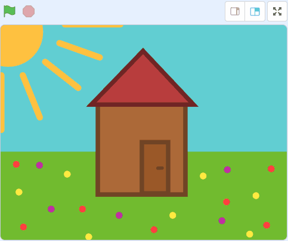
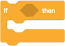
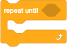
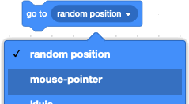
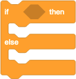
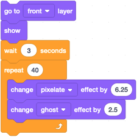

# Escaperoom
*Build an escape room in Scratch*

In this assignment we are going to build an escape room ourselves. We start in a room with some stuff (like a carpet, a painting, and a safe). The door in that room is 'locked'. The objective of the game is to open the door by clicking on it so you can get out.

This is what it will look like when you have completed the assignment:

We'll start with an empty project that already has all the necessary sprites in it. This way you only have to worry about the code blocks! You can open this empty project in the Scratch editor via our [escaperoom starter project](https://scratch.mit.edu/projects/629181159/editor). If you use the Sratch offline editor (which you can download [here](https://scratch.mit.edu/download)), you can also download the starter project [here](resources/escaperoom.sb3) and then load it in the offline editor.

## Starting situation

We start with putting all sprites in a good starting position when we start our game. If something accidentally shifts during the game, we know that next time everything will be in the right place as we intended.

### Hide House and 'escape' text

The house should only be shown when the door is open. So it should be hidden when the green flag is pressed. For this the event exists "when  clicked".

1. Select the **ontsnapt!**-sprite
2. Find the following block under *Events*:  
   
3. Drag this to the large white area in the middle
4. Find the following block under *Looks*:  
   
5. Attach it to the block above it

You can check if your code works in two ways:

* by clicking once with your mouse on your code block
* by clicking on the green flag at the top right

If all goes well, the house will now be hidden.

> Can you now do this for the **ontsnapt!2**-sprite?

### Show the other objects, with the correct costume

We are now going to make sure that all other objects are shown in the correct place, and with the correct costume, when the game is started.

Some sprites have more than 1 costume, you can see this by clicking on the 'Costumes' tab at the top:  

1. Select the **tapijt**-sprite
2. As above, drag the event "when the green flag is clicked" to the center
3. Now find the following block at *Looks*, and drag it to your code field:  
   
4. Now choose the correct costume number (is this `1` or `2`? Check out which costumes are available!)
5. Find the following block at *Looks*, and drag it to your code field:  
   

Does your code work? Test it!

> Can you now do this for the **schilderij**-sprite, the **kluis**-sprite, and the **deur**-sprite?

### Starting position

We also want every sprite to be shown in the correct place on the screen, so that it looks the same every time. To do this, we let Scratch know where the image should be in relation to the center of the screen. From left to right is indicated with an 'x', and from bottom to top with a 'y'. For this, let's start with the carpet.

1. Select the **tapijt**-sprite
2. Now find the following block at *Motion*, and drag it to your code field just **above** the "show" block:  
     
   This way we set the position right before showing it.
3. Make sure the number after the `x` and the `y` is both a `0`

> Can you now also do this for the **schilderij**-sprite, the **kluis**-sprite, the **deur**-sprite, and the cottage (i.e. the **ontsnapt!**-sprite - with this one, place it right **above** the "hide"-block)?

## Look around and search the room

In an escape room you have to look for clues to escape. In our small room we want to build the following things:

* If you look under the carpet, you won't find a clue
* If you look behind the painting, you will see that there is a code written on the wall
* If you want to open the safe, you will be asked for a code. The safe will open when you enter the correct code
* There is a key in the safe, and you must use that key to unlock the door
* When the door is unlocked, you can open it and escape outside

We are now going to make all these properties!

### Find Clues: Switch Costumes

First, we want to make sure you can lift the carpet, and slide the painting aside when you click on it. Clicking again should reset everything. We do this by using the different costumes for each sprite.

1. Select the **tapijt**-sprite
2. Now find the following block at *Events*, and drag it to an empty spot in your code field:  
   
3. Now find the following block at *Looks*, and drag it to your code field, and pin it to the correct event:  
   

> Can you now also do this for the **schilderij**-sprite?

### Showing the safe code: Editing a look

When you clicked on the painting, you may have noticed that there was no code written on the wall yet. We are now going to put a **created code** on the wall behind the painting, by editing the costume of the moved painting.

1. Select the **schilderij**-sprite
2. Click on the 'Costumes' tab at the top
3. Now select the second costume by clicking on it.  
   You should now see the moved painting in the middle of the screen
4. You can make the image slightly larger or smaller on your screen by using the `+` and `-` buttons at the bottom of the screen:  
   
5. Now click on the Text tool: 
6. Choose an appropriate color and a nice font.
   You'll find this at the top of the edit panel:  
   
7. Now click somewhere next to the painting on an empty spot, and type the first number of your own invented code. You will see these appear immediately. You may need to adjust the location and size a little more so that it is completely to your taste.
8. Do the same for the other numbers in your code, and put them in a slightly different place.
9. When you're done, click alternately on costume 1 and costume 2. Are you satisfied with the result? Otherwise, just edit some more until you're happy.

## Open the safe

If you want to open the safe, we have to ask for a code. And if that code has been entered correctly, the safe will open. What do we need to do for that?

#### Ask for the safe code: sensing

In Scratch, if you want to ask something to the user, or see if maybe a key has been pressed, or if the mouse might be moving, it's called "Observing". We're going to use this here.

1. Select the **kluis**-sprite
2. Start a new piece of code, and start an event again when the sprite is clicked
3. Now find the following block at *Sensing*, drag it to your code field, and pin it to the correct event:  
   
4. Adjust the question to `What is the code?`

#### Check the safe code and open the door: control

Now we only need to open the safe if the correct code is entered. Or in other words:

    IF the answer is the same as the code on the wall
    THEN I open the safe
    
To do this, we use the blocks under "Control" in Scratch. We might want to wait for something, or use an if-then question, or repeat something several times (or forever).

1. Now find the following block under *Control*, drag it to your code field, and attach it under the question `What is the code?`:  
   
2. We now have the `IF` and `THEN`. Now check if the answer is the same as our code on the wall.  
   Search for the next block at *Operators*, and drag it exactly in the correct place on the if-then block:  
   
3. The answer to the question will appear on the left in this green block. Find this at *Sensing* and drag it to the **left** box of the green block:  
   
4. The **right** box should now be the same as your own code on the wall! So adjust the number `50` to your own code
5. An open safe is stored with the sprite as the second costume. Can you now update the costume within the if-then block if the code is correctly entered? What do you need for this?

The code you entered after the if question is called a **condition**. Something that is true or false. Or which you can answer with Yes or No. In Scratch you can recognize these with the angular sides on a block:  

> Can you find some at *Sensing* and *Operators*?

There is one more thing we forgot: we only have to ask for the code when the safe door is closed. In other words:

    IF the costume number is the same as 1
    THEN I have to ask for the code and check

> Can you now use an if-then block (*Operators*) and an costume number (*Looks*) to ensure that the code is only requested when the safe is still closed?

##### BONUS

If you find the costume numbers difficult (what is 1 and 2 again?), you can also give each costume a *name*. This will make your code more readable:

    IF the costume is a closed safe
    THEN I have to ask for the code and check

> Can you see if you can change the name of the costumes to, for example, 'closed safe' and 'open safe'?  
>
> What changes do you see in the code block when the green flag is clicked?  
>
> What could you change in your code block so that when the sprite is clicked, it will use this name?  
> What do you find easier yourself?

## Using the key

The safe is now open. So now we want to show the key, and the key must also be used to unlock the door.

### Showing the key: signals

The key and the safe are two different sprites. Since you can only create Scratch blocks for one sprite, we need a way for one sprite to "talk" to another sprite. We do this with signals: The safe sends a message that it is open, and then any other sprite can listen to this message.

1. Select the **kluis**-sprite
2. Now find the following block at *Events*, drag it to your code field, and pin it at the bottom of the if-then block where you changed the costume in the previous assignment:  
   
3. Now click on `message1` and choose "New message"
4. Use as name for example `Safe is open`

A signal is now sent as soon as a correct code has been entered. Now we need to make the key respond to that message, and make it show.

1. Select the **sleutel**-sprite
2. Now find the following block at *Events*, and drag it to an empty spot in your code field:  
   
3. Now click on `message1` and choose the message you entered above (for example `Safe is open`)
4. At *Looks*, find the following block, and drag it to your code field and attach it to the yellow event block:  
   

Test your code by double clicking on the block you just created. Does the key show now?

The key may not show or may even be in the wrong place. We want the key to be "in" the safe: so the sprite must be shown in the foreground, and the position must also be correct. You've done this before:

1. First drag the key to the correct place (i.e. in the safe) in the example screen at the top right
2. If this is correct, find the following block at *Motion*, and drag it to your code field just **above** the "hide" block at the green flag event:  
     
   The number after the `x` and the `y` are now not zero, but a different number (for example `-89` and `28`)
3. Find the following block under *Looks*, drag it to your code field, and pin it under the "show" block:  
   

You should be able to test both blocks by double-clicking on them: With one block it hides, and with the other it shows in front of the safe.

### Drag the key to the door: repeat

The idea is now that the key is dragged to the door in order to unlock it.

To be able to drag a sprite during the game, we need to create something that will make the sprite follow the mouse pointer **as long as** we hold down the mouse button. In other words, the key must continue to follow the mouse pointer **until** we release the mouse button.

In Scratch we can use repetition. In such a block you tell *what* should be repeated all the time, and *when* it should stop. As with the if-then block, we need a **condition** to tell what happens to the angular blocks:  

1. Select the **sleutel**-sprite
2. Now find the following block at *Events*, and drag it to an empty spot in your code field:  
   
3. Now find the following block at *Control*, drag it to your code field, and pin it to the correct event:  
   

So the key must continue to follow the mouse pointer **until** we release the mouse button. There is just no block that checks whether the mouse button has been released. But we can check if the mouse button is pressed. That's why we're going to create the following in a Scratch block:

    REPEAT UNTIL the mouse is no longer pressed
        go to the mouse pointer

The following condition blocks exist for this:

* 
* 
* 

> Can you now complete the repeat block by using the blocks above in the proper way?

You can now test it by clicking the green flag and opening the safe. Can you now move the key during the game?

### Unlocking the door: if-then-else

The next step is to unlock the door if the key is used for the door. Then we hide the key (you don't need it anymore anyway). But if the key is released somewhere else (for example on the carpet), we want to put it back in the safe. That way the player knows that something else needs to be done with the key.

Or, to say this in another 'code' way:

    IF I touch the door
    THEN unlock the door
        and hide the key
    ELSE
        go back to the safe

1. Now find the if-then-else block under *Control*, drag it to the code field, and attach it under the repeat block:  
   
2. At *Sensing*, find the condition if you touch something, and put it in the correct place in the code block  

> To unlock the door, we have to use a signal again, for example a message `Door unlocked`. Can you now set this signal yourself at the key?  

> Can you also unlock the door as soon as this signal is received?  
> Hint: you need to add this code to the **deur**-sprite!  

> Can you also hide the key after the door has been unlocked?  

> Can you return the key to the safe if it *didn't* touch the door?

## Escape

The last thing we need to do is go out the door and tell you escaped!

### To go outside

> Can you add to the **deur**-sprite the event when the sprite is clicked, then we show the **ontsnapt!**-sprite (the cottage)?  
> Hint 1: You may only show the ontsnapt-sprite when the door is unlocked! Use an if-then block to check if the door is really unlocked (what costume should the door have?)  
> Hint 2: Use a signal to tell the **ontsnapt!**-sprite to show. For example a message `Won`  

> Can you also make the **ontsnapt!2**-sprite (the message "Je bent ontsnapt!") appear when the player has escaped?  
> Hint: You can use the same signal as with the **ontsnapt!**-sprite.

### Effects

Use the code blocks below to add a fun effect to the **ontsnapt!2**-sprite, once it receives a message that the player has won.

## Expand

You should now have added all the important code to complete the game. Can you play it all by yourself now? What else would you like to add?

Have lots of fun!

The project on which this assignment is based can be viewed [here](https://scratch.mit.edu/projects/578306126/) and the completed project can also be downloaded [here](solutions/escaperoom.sb3) for the offline Scratch editor.

 This work is licensed under a <a rel="license" href="https://creativecommons.org/licenses/by-nc-sa/4.0/deed.en">Creative Commons Attribution-NonCommercial-ShareAlike 4.0 International License</a>.
